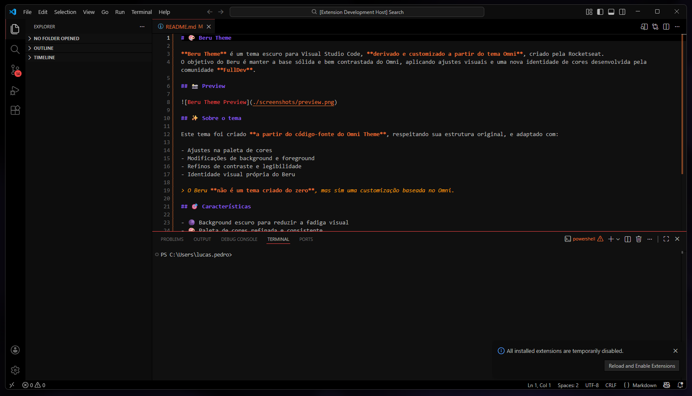

# 🎨 Beru Theme

**Beru Theme** é um tema escuro para Visual Studio Code, **derivado e customizado a partir do tema Omni**, criado pela Rocketseat.
O objetivo do Beru é manter a base sólida e bem contrastada do Omni, aplicando ajustes visuais e uma nova identidade de cores desenvolvida pela comunidade **FullDev**.

## 📸 Preview

## ✨ Sobre o tema

Este tema foi criado **a partir do código-fonte do Omni Theme**, respeitando sua estrutura original, e adaptado com:

- Ajustes na paleta de cores
- Modificações de background e foreground
- Refinos de contraste e legibilidade
- Identidade visual própria do Beru

> O Beru **não é um tema criado do zero**, mas sim uma customização baseada no Omni.

## 🎯 Características

- 🌑 Background escuro para reduzir a fadiga visual
- 🎨 Paleta de cores refinada e consistente
- 🔥 Destaques em laranja e roxo
- ✨ Verde vibrante para estados de sucesso
- 📝 Alto contraste para leitura prolongada
- 🧠 Base sólida herdada do Omni Theme

## 🚀 Instalação

1. Abra o Visual Studio Code
2. Acesse **Extensions** (`Ctrl + Shift + X`)
3. Busque por **Beru Theme**
4. Clique em **Install**
5. Pressione `Ctrl + K` `Ctrl + T` e selecione **Beru**

## 🧩 Tema base

Este tema é baseado no:

- **Omni Theme** — Rocketseat
  https://github.com/rocketseat/omni-theme

Todos os créditos pelo tema base pertencem à equipe da Rocketseat.

## 👥 Comunidade

Desenvolvido pela **FullDev Community**
https://fulldev.com.br

## 🤝 Contribuindo

Contribuições são bem-vindas.
Sinta-se à vontade para abrir issues ou pull requests.

## 📝 Licença

MIT License
O Beru segue a mesma licença permissiva do tema base.

Co-authored-by: ComunidadeFullDev <contato@fulldev.com.br>
